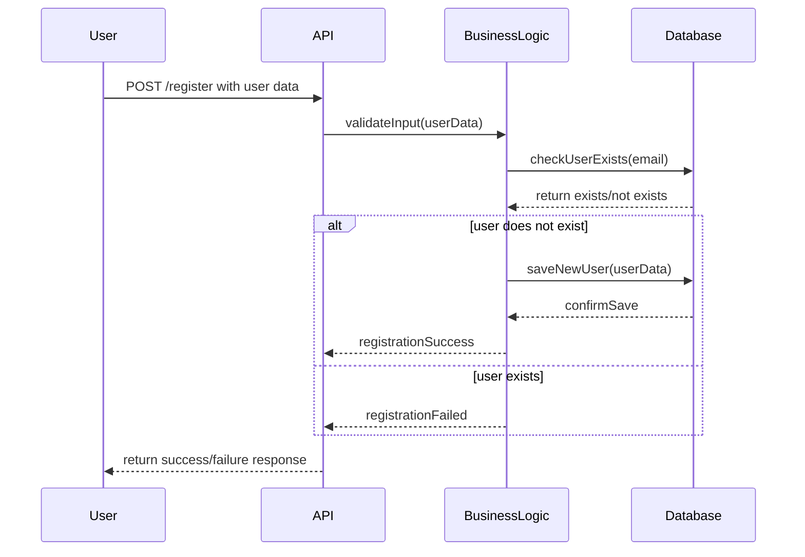
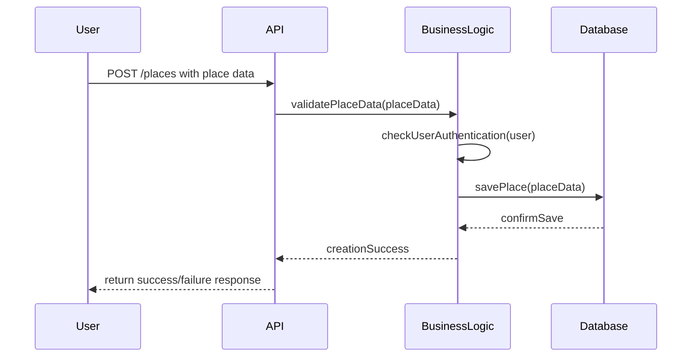
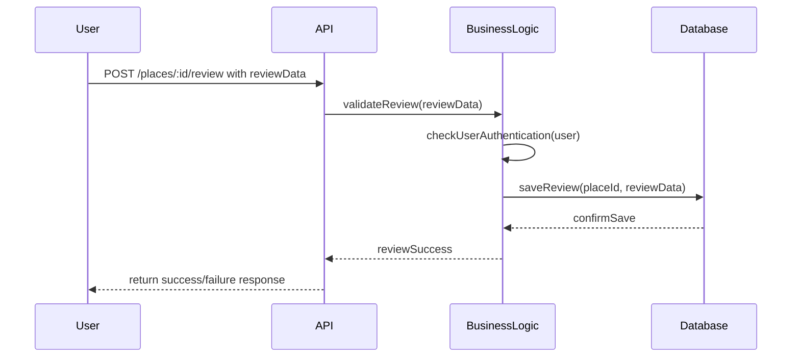
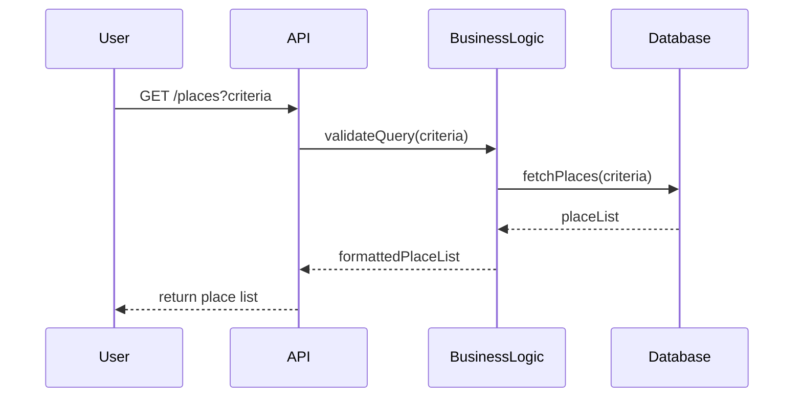

# HBnB API Sequence Diagrams

This document contains sequence diagrams for four main API calls in the HBnB application, showing interactions between Presentation, Business Logic, and Persistence layers.

---

## 1. User Registration
**Purpose:** Allows a new user to sign up for an account.

---

## 2. Place Creation
**Purpose:** Allows a user to create a new place listing.

---

## 3. Review Submission
**Purpose:** Allows a user to submit a review for a place.

---

## 4. Fetching a List of Places
**Purpose:** Retrieves a list of places based on user-provided criteria.

---

## Explanatory Notes
- **Presentation Layer (API):** Handles incoming requests, validates input, and returns responses to the client.
- **Business Logic Layer:** Manages authentication, authorization, data validation, and coordinates processing with the database.
- **Persistence Layer (Database):** Responsible for storing, retrieving, and confirming data for users, places, and reviews.

All diagrams clearly show the flow from user request to database interaction and back to the user.

