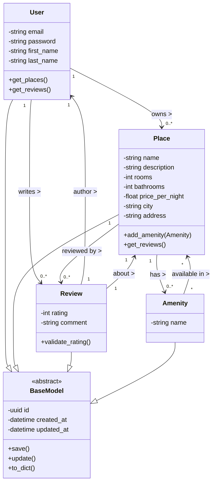

# HBnB Business Logic Layer – Class Diagram Documentation

This document provides a **detailed class diagram** for the Business Logic Layer of the **HBnB** application. It includes:
- A Mermaid.js class diagram
- Descriptions of all core entities: `User`, `Place`, `Review`, `Amenity`, and `BaseModel`
- Explanation of the relationships between entities
- Notes on business rules and behavior

---

## 🏛️ **1. Overview**
The Business Logic Layer contains the **core domain entities** and the rules that govern their interactions.

Every HBnB entity inherits from a shared superclass **BaseModel**, which provides universal attributes and methods.

This ensures consistency across all models.

---

## 📘 **2. Mermaid.js Class Diagram**
Paste this into any Mermaid-enabled Markdown renderer.

---

## 🧩 **3. Entity Descriptions**

### **BaseModel (Abstract Class)**
All entities inherit from BaseModel.

**Attributes:**
- `id`: Unique UUID4 identifier
- `created_at`: Timestamp of creation
- `updated_at`: Timestamp of last update

**Methods:**
- `save()`: Persist entity
- `update()`: Modify attributes + refresh timestamp
- `to_dict()`: Serialize entity for API representation

---

### **User**
Represents a registered user of the HBnB platform.

**Attributes:**
- `email`, `password`, `first_name`, `last_name`

**Methods:**
- `get_places()`: Places owned by this user
- `get_reviews()`: Reviews written by this user

**Relationships:**
- One User → Many Places
- One User → Many Reviews

---

### **Place**
Represents a rental unit posted in the HBnB system.

**Attributes:**
- `name`, `description`
- `rooms`, `bathrooms`
- `price_per_night`
- `city`, `address`

**Methods:**
- `add_amenity(amenity)`
- `get_reviews()`

**Relationships:**
- One Place → Many Reviews
- One Place → Many Amenities
- One Place belongs to a single User

---

### **Review**
Represents a user-written review about a place.

**Attributes:**
- `rating` (0–5)
- `comment`

**Methods:**
- `validate_rating()`

**Relationships:**
- Each Review belongs to **one User**
- Each Review belongs to **one Place**

---

### **Amenity**
Represents a feature offered by a place (WiFi, AC, Pool, etc.).

**Attribute:**
- `name`

**Relationship:**
- Many Amenities ↔ Many Places

---

## 🔗 **4. Relationship Summary**

| Relationship | Type | Example |
|--------------|-------|---------|
| User → Place | 1 to many | User owns multiple places |
| User → Review | 1 to many | User writes reviews |
| Place → Review | 1 to many | A place has many reviews |
| Place ↔ Amenity | many-to-many | A place can have multiple amenities |
| Review → User | many-to-one | Each review has one author |
| Review → Place | many-to-one | Each review refers to one place |

---

## 📝 **5. Summary**
This class diagram provides a complete representation of the **Business Logic Layer** of HBnB. It defines:
- Core entities
- Important business attributes
- Shared behavior through inheritance
- Real-world relationships represented via UML associations

This documentation can be added to your project’s `/docs` folder or included directly in your README.

---

If you'd like, I can also create:
- A **sequence diagram** (e.g., "Create Review" flow)
- A **persistence layer** diagram
- A **database ERD** matching this structure

