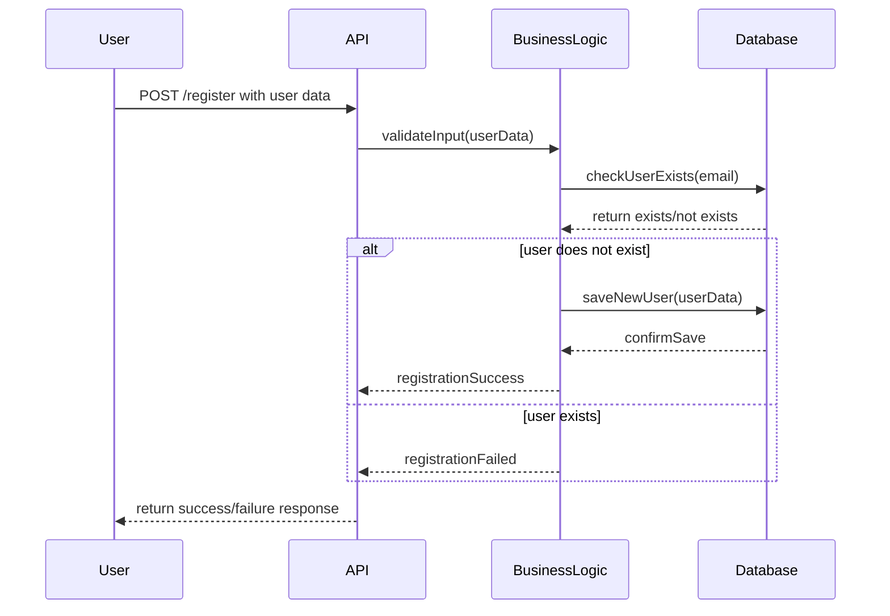
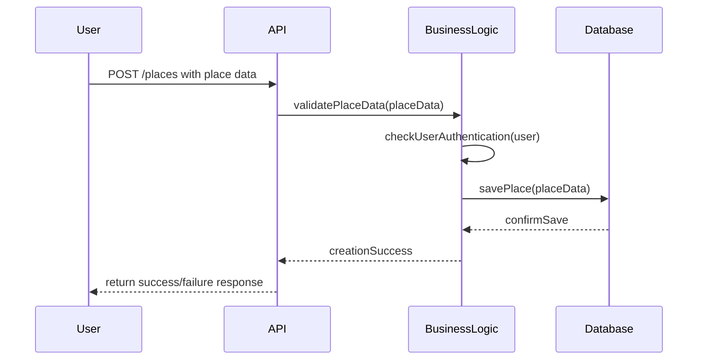
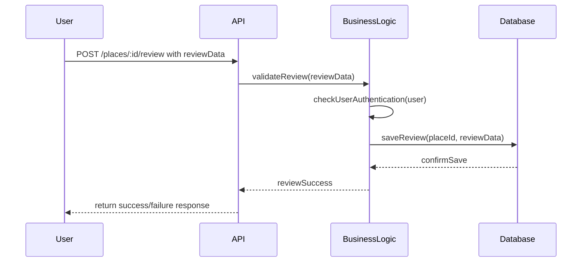
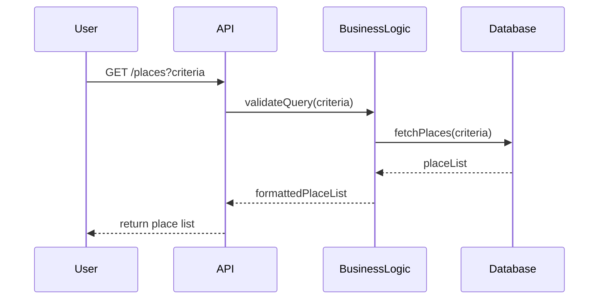

# HBnB Project Technical Documentation

## Introduction
The HBnB application is a platform designed for users to browse, create, and review places. This technical documentation serves as a comprehensive blueprint for the HBnB project, guiding the implementation phases and providing a clear reference for the system’s architecture and design. It includes the high-level package diagram, the detailed class diagram for the Business Logic layer, and sequence diagrams for core API calls.

---

## High-Level Architecture
### High-Level Package Diagram
*Diagram Pending* (insert package diagram from Task 1)

**Explanation:**
- The HBnB application follows a layered architecture:
  - **Presentation Layer:** Handles user interactions through API endpoints and services.
  - **Business Logic Layer:** Implements the core logic, including validation, authentication, and coordination between components.
  - **Persistence Layer:** Manages data storage and retrieval in the database.
- The facade pattern is used to provide a simplified interface for the Presentation Layer to interact with the Business Logic Layer.

---

## Business Logic Layer
### Detailed Class Diagram
*Diagram Pending* (insert class diagram from Task 2)

**Explanation:**
- The Business Logic Layer includes classes representing entities such as `User`, `Place`, `Review`, and service classes for processing requests.
- Relationships between classes are clearly defined, including associations, inheritance, and dependencies.
- This layer ensures that all operations follow the business rules and constraints of the HBnB application.

---

## API Interaction Flow
### 1. User Registration
**Purpose:** Allows a new user to sign up for an account.

### 2. Place Creation
**Purpose:** Allows a user to create a new place listing.

### 3. Review Submission
**Purpose:** Allows a user to submit a review for a place.

### 4. Fetching a List of Places
**Purpose:** Retrieves a list of places based on user-provided criteria.

### Explanatory Notes for All API Flows
- **Presentation Layer (API):** Handles requests, input validation, and returns responses.
- **Business Logic Layer:** Manages authentication, authorization, and processing of data.
- **Persistence Layer (Database):** Responsible for storing, retrieving, and confirming data.

---

**Document Notes:**
- This document combines the architectural overview, detailed class design, and sequence diagrams into a single reference guide.
- It serves as a blueprint for developers to understand the structure and workflow of the HBnB system.

**Next Steps:**
- Insert high-level package diagram and detailed class diagram images.
- Review the document for clarity and completeness.
- Finalize formatting and convert to PDF or Word for distribution.

